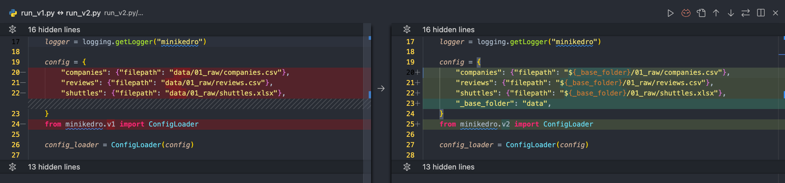

# minikedro

Reimplementing something is one of the best way to learn. This is a minimalistic implementation of Kedro (inspired by minGPT by Karpathy).

## Structure
The repository is a clone of the standard spaceflights repository with some additional files:

Script: `run.py`
Module: `src/minikedro/v2/__init__.py
- run_v1.py
- `src/minikedro/v1/__init__.py

In each step, you would run different versions of `run_vx.py` and it will use the class defined in `minikedro.vx.py`. For example, when you are running `run_v1.py`, you should read `src/minikedor_v1/__init__.py`

Each step I try to refactor part of the script and introduce a new feature from Kedro. By the end you will get something resemble Kedro with a basic set of features.

There is also a `dataset.ipynb` to demo how dataset works (out of scope)

# How to use this repository
First, clone this repository and install the package with:
- `git clone https://github.com/noklam/miniKedro.git`
- `pip install -e .`

Run `python run.py` and the following scripts and observe the difference between each versions.
The repository is created incrementally, so you can view the changes clearly from the commit history: https://github.com/noklam/miniKedro/commits/main/

The best way to understand the changes are open this repository in an IDE and compare the diff between different versions. For example, this is a screenshot of comparing `run_v1.py` and `run_v2.py`:

## run.py
The basic structure of a script without any Kedro

## run_v1.py - Extract Configuration
-  Extract configuration to a dictionary.

## run_v2.py - Introduce ConfigLoader
- Replace shared config with template value `${_base_folder}` with  `ConfigLoader`

## run_v3.py - Introduce Dataset and DataCatalog
- `dataset.ipynb` to explain how `kedro-datasets` works and demonstrate the I/O capability (`save` and `load` interface)
- Add `DataCatalog` with the ability to `load` and `save`

## run_v4.py - Load data only when it's needed
- Extract Configuration to a `steps` as a list of dictionary
- Save the intermediate data as dataset too

## run_v5.py - Restructure the functions call into a dictionary
- Make use of the `steps` variable and loop through the steps.

## run_v6.py - Introduce Pipeline and Nodes
- Introduce a thin `list` wrapper called `pipeline` and `step` wrapper called `nodes`
- Rename `steps` as `nodes`, `step` as `node_`

## run_v7.py - Introduce Hook

## run_v8.py - Replace `kedro` import with `import minikedro.v8 as kedro`
- Replace `pipeline` from `kedro` with `minikedro.v7`
- Replace the configuration dictionary and load it from `base/conf/catalog.yml` instead.
- Replace the `pipeline` from script and move it to `pipeline.py`
